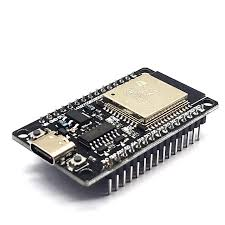
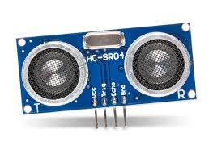

# Librerias Python
```bash
pip install pygame
pip install opencv-python
pip install numpy
pip install pyserial
```

## Driver LabSillicon
```bash
https://www.silabs.com/developers/usb-to-uart-bridge-vcp-drivers?tab=downloads
```

### Path to init application when Windows start
```bash
cd C:\Users\<Nombre de usuario>\AppData\Roaming\Microsoft\Windows\Start Menu\Programs\Startup
```

### File .bat
You need to manipulate the root to script
```bash
@echo off
cd "C:\Users\HP\Documents\IQOS-ShelfDetection-master"
python change.py
pause
```

### Hardware

<ul>
  <li>ESP32 entrada C</li>
  <li>Ultrasonicos HSRC4</li>
</ul>

<div style="display: flex; gap: 10px;">
  
  
</div>